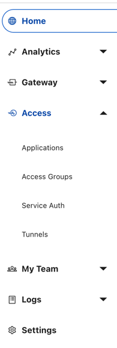
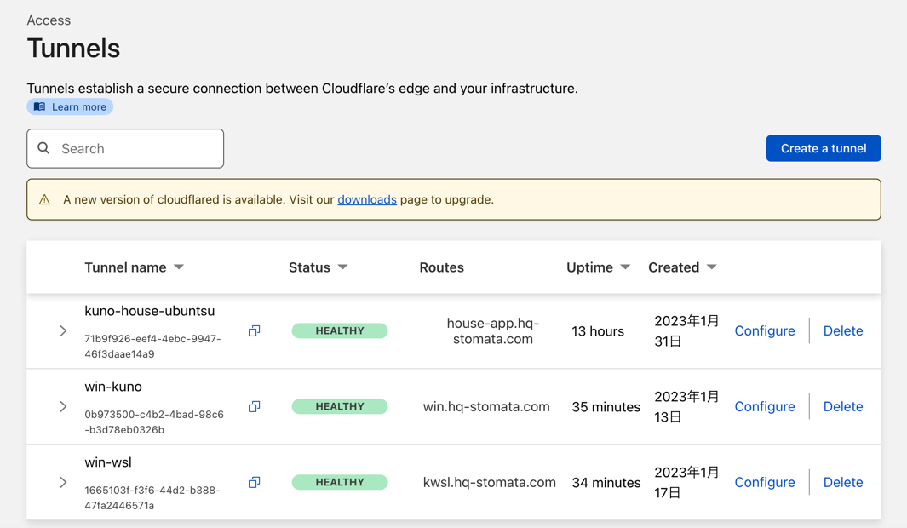
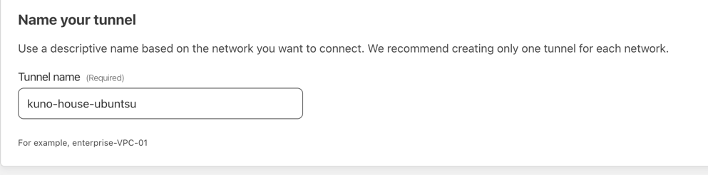
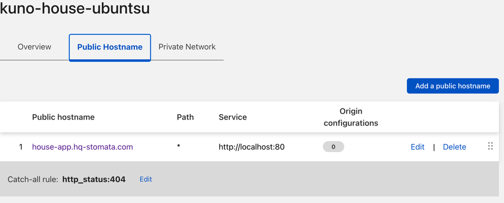

# Cloudflare TunnelとBasic Authenticationでログインする Nginxをリバースプロキシとして利用した 基本的な Web serverの設定の仕方
例: Client -(global)->DNS(my-app.hp-stomata.com)-> Cloudflare Tunnel-> nginx (:80) -(basic-auth)-(localhost)-> web app frontend (:8501)  という構成
### どうして Cloudflare tunnelを使うのか? 
- ⚡ いちいちWork station PCのファイアウォールやローカルのルータのポート変換などを気にせずに、localhostで起動したサーバーに対して,public に公開できる. (ngrokに近い)
- 🔑 Cloudflare DNS を設定することでHTTPS, 標準でDOS対策ありのセキュリティ設定が非常にラク. DNS取得年間 1500円程度.


## UbuntuにおけるNginxの設定の仕方

## nginxの初期設定 (``/etc/nginx/nginx.conf`` の内容設定 [親の設定ファイル])
最終行の `include /etc/nginx/conf.d/*.conf;`で読みに行く設定ファイルが指定されている.
```shell
user  nginx;
worker_processes  auto;

error_log  /var/log/nginx/error.log notice;
pid        /var/run/nginx.pid;


events {
    worker_connections  1024;
}


http {
    include       /etc/nginx/mime.types;
    default_type  application/octet-stream;

    log_format  main  '$remote_addr - $remote_user [$time_local] "$request" '
                      '$status $body_bytes_sent "$http_referer" '
                      '"$http_user_agent" "$http_x_forwarded_for"';

    access_log  /var/log/nginx/access.log  main;

    sendfile        on;
    #tcp_nopush     on;

    keepalive_timeout  65;
    client_max_body_size 200M;

    proxy_read_timeout 120;
    proxy_connect_timeout 120;
    proxy_send_timeout 120;

    #gzip  on;

    include /etc/nginx/conf.d/*.conf;
}
```


## `/etc/nginx/conf.d/default.conf` (デフォルト設定ファイル)のバックアップをとる.
```shell
cd /etc/nginx/conf.d
sudo cp default.conf default.conf.bak
```
```shell
vim default.conf
```

## Basic auth用の toolインストール
```shell
sudo apt-get install apache2-utils
```

## user名を設定するコマンド {my-user}に自分が独自に設定するuser名
```shell
sudo htpasswd -c /etc/nginx/.htpasswd {my-user}
```
プロンプトでパスワードが二回聞かれるので設定する.


## FastAPI, streamlit, DjangoなどのWeb applicationとNginxをつなぐ.

```shell
server {
    listen       80;
    server_name  localhost;

    #access_log  /var/log/nginx/host.access.log  main;

    # location / {
    #     root   /usr/share/nginx/html;
    #     index  index.html index.htm;
    # }

    #error_page  404              /404.html;

    # redirect server error pages to the static page /50x.html
    #
    error_page   500 502 503 504  /50x.html;
    location = /50x.html {
        root   /usr/share/nginx/html;
    }
    location / {
    
    # Basic認証有効化
    auth_basic "Login Authentication";
    # パスワードファイルの指定
    auth_basic_user_file /etc/nginx/.htpasswd;
    
	proxy_pass http://127.0.0.1:8501/; # localで起動しているアプリ (Unix socket domainを利用するほうが高速).
	proxy_set_header X-Forwarded-For $proxy_add_x_forwarded_for;
	proxy_set_header Host $http_host;
	proxy_http_version 1.1;
	proxy_set_header Upgrade $http_upgrade;
	proxy_set_header Connection "upgrade";
}

}
```
* ``auth_basic``がなにかについて
> 保護する場所の内部で、auth_basic ディレクティブを指定し、パスワードで保護された領域に名前を付けます。この領域の名前は、認証情報を要求する際のユーザ名/パスワードのダイアログウィンドウに表示されます。

とnginxのマニュアルに書かれているが, 画面にそのような文字は現れないので、よくわからないです.


## `cloudflared`をubuntuにinstallしてTunnel作成
1. Cloudflare ログイン -> Zero Trust -> Access

2. Create tunnel

3. Tunnelに名前をつける

4.Ubuntu PCでページに表示される以下のようなコマンドをコピペして実行
```shell
curl -L --output cloudflared.deb https://github.com/cloudflare/cloudflared/releases/latest/download/cloudflared-linux-amd64.deb && 

sudo dpkg -i cloudflared.deb && 

sudo cloudflared service install xxxx
```
5. DNSの設定 `{サブドメイン名(他と重複しない自分の好きなURL名)}.{取得したドメイン名}`を設定する. サブドメインが登録されていませんと警告が出るが問題ない.



